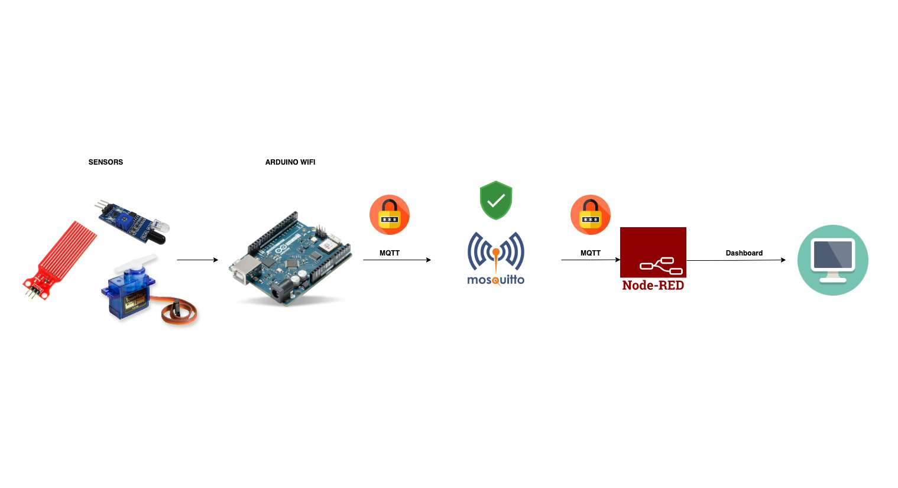

# Secure-SmartCity

In this project the idea is to provide a secure communication between client and Mosquitto broker using TLS/SSL to [this project](https://github.com/BenedettoSimone/SmartCity-Arduino).

## Architecture

The system consists of several sensors, connected to an Arduino board, which send information to a Mosquitto broker using the MQTT protocol. The broker then sends this information to a Dashboard built with Node-RED.

## Developed by
[Simone Benedetto](https://github.com/BenedettoSimone) 
[Salerno Daniele](https://github.com/DanieleSalerno) 