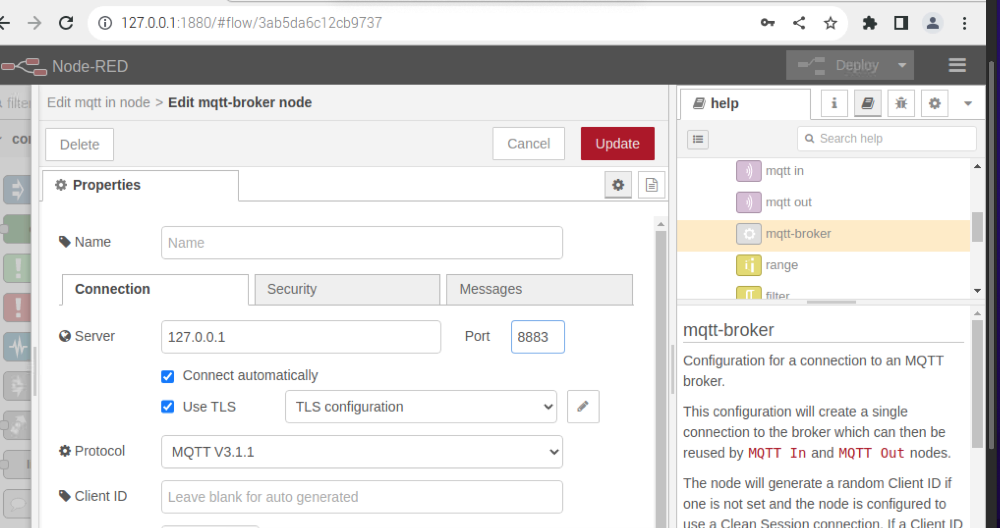

# Secure-SmartCity

In this project the idea is to provide a secure communication between client and Mosquitto broker using SSL/TLS to [this project](https://github.com/BenedettoSimone/SmartCity-Arduino).


## Prerequisites
* [OpenSSL](https://www.openssl.org);


## Architecture
<p align="center"></p>
The system consists of several sensors, connected to an Arduino board, which send information to a Mosquitto broker using the MQTT protocol. The broker then sends this information to a Dashboard built with Node-RED. 

**SECURITY FEATURES:**
* Both clients are authenticated with username and password;
* Certificates and keys were created for the Mosquitto broker only.


# Create Root CA
Create the Root CA is the first step to enable secure SSL/TLS communication. Once the RootCA has been created, it will be possible to use it to authenticate the Mosquitto broker's certificate.

1. Open the terminal and go to the folder where you want to create the Root CA.
2. Use the following command to create a configuration file for OpenSSL. _The following procedure will have to be repeated twice, because we need two different configurations (one for the rootCA and one for the server). We have used the following name for the second file ``openssl-s.cnf``._
         
   ```
   nano openssl-ca.cnf
   ```
       
   Insert the following template in the file ``openssl-ca.cnf``:
   ```bash
   [ req ]
   prompt             = no
   default_bits       = 2048
   default_md         = sha256
   distinguished_name = dn
    
   [ dn ]
   C  = IT
   ST = State
   L  = City
   O  = Organization Name
   OU = Organizational Unit Name
   CN = Common Name (e.g. localhost, IP address)
   emailAddress = Email Address
   ```
   This template defines some useful parameters for the creation of the certificate, such as the number of bits of the key, the hashing algorithm used and distinctive data such as the country, state, city, organization name and common name of the certificate. 
   <br><br>
   It's important that ``Organization Name`` and ``Organization Unit Name`` are different in the two files.

       

3. Save the two files and then proceed to create the private key. 

4. Use the following command to generate a 2048-bit private key for the Root CA (Make sure you are in the same directory where you saved the `openssl-ca.cnf` file). The key will be protected by a passphrase.
    ```bash
    openssl genrsa -des3 -out rootCA.key 2048
    ```
5. Use the following command to create the Root CA certificate:

    ```bash
    openssl req -new -x509 -key rootCA.key -days 365 -out rootCA.crt -config openssl-ca.cnf
    ```
    This command will create a ``rootCA.crt`` file in your folder, containing the Root CA certificate.


# Create certificate for the broker

Now, you need to create a certificate for the Mosquitto broker and configure the broker properly to use the signed certificate.

1. Create the public and private key for the broker using the following command:

   ```
   openssl genrsa -out broker.key 2048
   ```
   This key couple is needed to create a certificate request file (CSR) for the Mosquitto broker, which will contain its public key. The Mosquitto broker's certificate will then be signed with our Root CA.

2. Create a certificate request file (CSR) for the Mosquitto broker with the command:

   ```
   openssl req -new -key broker.key -out broker.csr -config openssl-s.cnf
   ```

3. Sign the CSR with our Root CA to generate the Mosquitto broker's certificate with the command:

   ```
   openssl x509 -req -in broker.csr -CA rootCA.crt -CAkey rootCA.key -CAcreateserial -out broker.crt -days 3650 -sha256
   ```

4. After generating all the files, copy `rootCA.crt`, `broker.crt` and `broker.key` to the RaspberryPi. The following commands were used to copy the certificates into Mosquitto's `certs` folder.
   
   ```
   sudo cp /home/labiot/Desktop/cryptomat/broker.key /etc/mosquitto/certs/
   sudo cp /home/labiot/Desktop/cryptomat/broker.crt /etc/mosquitto/certs/
   sudo cp /home/labiot/Desktop/cryptomat/rootCA.crt /etc/mosquitto/certs/
   ```

5. Configure the Mosquitto broker to use the signed certificate by adding these lines (absolute path) in the broker's configuration file `mosquitto.conf`:
   
   ```
   sudo /etc/init.d/mosquitto stop
   sudo nano /etc/mosquitto/mosquitto.conf
   ```
   
   ```
   listener 8883
   allow_anonymous true
   cafile /etc/mosquitto/certs/rootCA.crt
   certfile /etc/mosquitto/certs/broker.crt
   keyfile /etc/mosquitto/certs/broker.key
   ```
   ```
   sudo service mosquitto start
   ```


   
# Username and password authentication
To add an extra layer of security, the broker can be configured to require client authentication via a valid username and password before allowing the connection. Since we are using SSL/TLS, username and password will be encrypted during transmission.

1. Create the password file and the new user with the following command. Then enter the password. (We created two users, arduino_client and node_red)
   ```
   mosquitto_passwd -c passwordfile <username>
   ```
   To add other users use the following command, adding username and password.
   ```
   mosquitto_passwd -b passwordfile <username> <password>
   ```

2. Copy the `passwordfile` in the Mosquitto folder and modify the `mosquitto.conf` adding the following lines.
   
   ```
   sudo cp /home/labiot/Desktop/cryptomat/passwordfile /etc/mosquitto/
   ```
   ```
   sudo /etc/init.d/mosquitto stop
   sudo nano /etc/mosquitto/mosquitto.conf
   ```
   ```
   allow_anonymous false
   password_file /etc/mosquitto/passwordfile
   ```

# Configure NodeRed
1. Access to `http://localhost:1880` and modify the configuration of the broker node changing the port to `8883` and setting the use of `TLS`.
2. Set username and password for NodeRed client.
3. Deploy and check the connection of each node.

<p align="center"></p>


# Check if everything is working properly
Before proceeding with sending the messages from the Arduino we will simulate the client with our pc to check if all the procedure carried out previously is correct.


1. Publish a test message on the `street_lights` topic. In this command you need to replace the rootCA path, the hostname and the password.

   ```
   mosquitto_pub --cafile /Users/benedettosimone/Desktop/cryptoMat/rootCA.crt -h 192.168.1.121 -t topic/street_lights -m "Test message" -u arduino_client -P <pwd>
   ```

# Arduino client
In order to use certificates on any board equipped with NINA Wi-Fi module, we used [arduino-fwuploader](https://arduino.github.io/arduino-fwuploader/2.2/) to flash the certificate using the following command.
  ```
  ./arduino-fwuploader certificates flash -f rootCA.crt -b arduino:megaavr:uno2018 -a <port>
   ```

## Developed by
[Simone Benedetto](https://github.com/BenedettoSimone)<br>
[Salerno Daniele](https://github.com/DanieleSalerno) 
