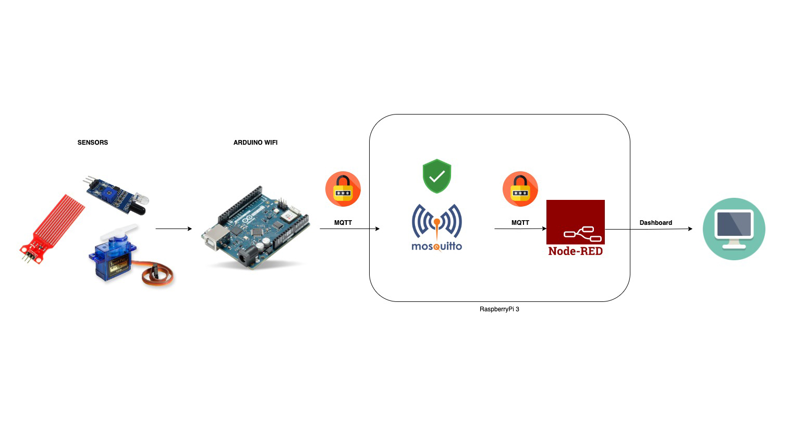

# Secure-SmartCity

In this project the idea is to provide a secure communication between client and Mosquitto broker using SSL/TLS to [this project](https://github.com/BenedettoSimone/SmartCity-Arduino).

## Prerequisites
* [OpenSSL](https://www.openssl.org);

## Architecture
<p align="center"></p>
The system consists of several sensors, connected to an Arduino board, which send information to a Mosquitto broker using the MQTT protocol. The broker then sends this information to a Dashboard built with Node-RED.


# 1. Create Root CA
Create the Root CA is the first step to enable secure SSL/TLS communication. Once the RootCA has been created, it will be possible to use it to authenticate the Mosquitto broker's certificate.

1. Open the terminal and go to the folder where you want to create the Root CA.
2. Use the following command to create a configuration file for OpenSSL:

    ```bash
    nano openssl.cnf
    ```
    
    Insert the following template in the file ``openssl.cnf``:
    
    ```bash
    [ req ]
    prompt             = no
    default_bits       = 2048
    default_md         = sha256
    distinguished_name = dn
    
    [ dn ]
    C  = IT
    ST = State
    L  = City
    O  = Organization Name
    CN = Common Name (e.g. your name or your server's hostname)
    ```
    This template defines some useful parameters for the creation of the certificate, such as the number of bits of the key, the hashing algorithm used and distinctive data such as the country, state, city, organisation name and common name of the certificate. 


3. Save the `openssl.cnf` file and then proceed to create the private key. 

4. Use the following command to generate a 2048-bit private key for the Root CA (Make sure you are in the same directory where you saved the `openssl.cnf` file).
    ```bash
    openssl genrsa -out rootCA.key 2048
    ```
5. Use the following command to create the Root CA certificate:

    ```bash
    openssl req -new -x509 -key rootCA.key -out rootCA.crt -config openssl.cnf
    ```
    This command will create a ``rootCA.crt`` file in your folder, containing the Root CA certificate.


# 2. Create certificate for the broker

Now, you need to create a certificate for the Mosquitto broker and configure the broker properly to use the signed certificate.

1. Create the public and private key for the broker using the following command:

   ```
   openssl genrsa -out broker.key 2048
   ```
   This key couple is needed to create a certificate request file (CSR) for the Mosquitto broker, which will contain its public key. The Mosquitto broker's certificate will then be signed with our Root CA.

2. Create a certificate request file (CSR) for the Mosquitto broker with the command:

   ```
   openssl req -new -key broker.key -out broker.csr -config openssl.cnf
   ```

3. Sign the CSR with our Root CA to generate the Mosquitto broker's certificate with the command:

   ```
   openssl x509 -req -in broker.csr -CA rootCA.crt -CAkey rootCA.key -CAcreateserial -out broker.crt -days 3650 -sha256
   ```

4. Configure the Mosquitto broker to use the signed certificate by adding these lines in the broker's configuration file `mosquitto.conf`:

   ```
   cafile /path/to/rootCA.crt
   certfile /path/to/broker.crt
   keyfile /path/to/broker.key
   ```
   _NB: it's needed to change the listener port to `8333` in the broker configuration._


## Developed by
[Simone Benedetto](https://github.com/BenedettoSimone)<br>
[Salerno Daniele](https://github.com/DanieleSalerno) 